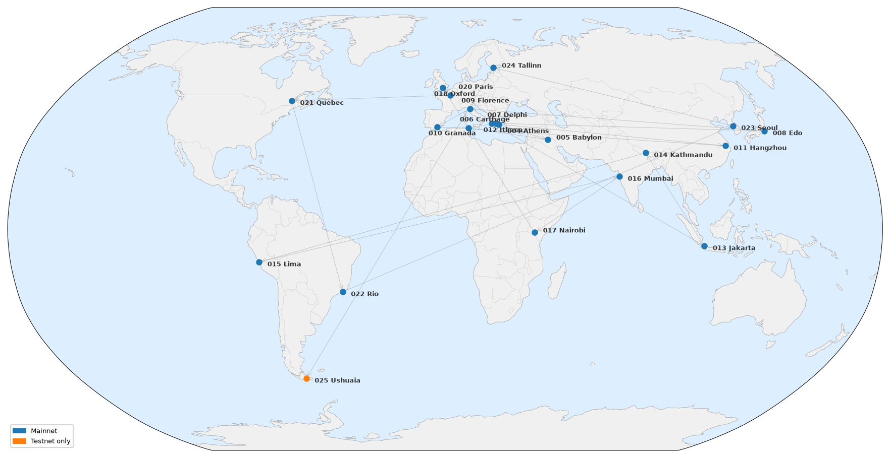

# tezos protocols map
Mapping Tezos protocol names on the globe

## context
* *cheeses* for feature test nets 
    * => no clear list for those AFAIK.

* *cities* for protocols testnets and protocols applied on mainnet 
    * => cf. https://tezos.gitlab.io/protocols/naming.html
    * can be mapped :-) 

## To-do
- ~~script to extract cities from tezos project~~ done — `scripts/update_gpx.py`
- ~~trigger this project on changes from previous URL~~ done — quarterly GitHub Action
- ~~generate map~~ done — `scripts/generate_map.py` renders `map.png` from `tezos.gpx`
